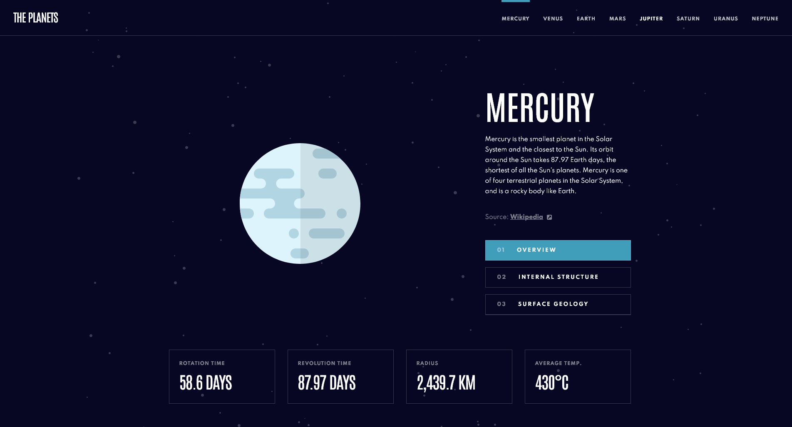

# Frontend Mentor - Planets fact site solution

This is a solution to the [Planets fact site challenge on Frontend Mentor](https://www.frontendmentor.io/challenges/planets-fact-site-gazqN8w_f). Frontend Mentor challenges help you improve your coding skills by building realistic projects. 

## Table of contents

- [Overview](#overview)
  - [The challenge](#the-challenge)
  - [Screenshot](#screenshot)
  - [Links](#links)
- [My process](#my-process)
  - [Built with](#built-with)
  - [What I learned](#what-i-learned)

## Overview

### The challenge

Users should be able to:

- View the optimal layout for the app depending on their device's screen size
- See hover states for all interactive elements on the page
- View each planet page and toggle between "Overview", "Internal Structure", and "Surface Geology"

### Screenshot



### Links

- Solution URL: [https://zakhi.github.io/planets-fact-site/](https://zakhi.github.io/planets-fact-site/)
- Live Site URL: [https://zakhi.github.io/planets-fact-site/](https://zakhi.github.io/planets-fact-site/)

## My process

### Built with

- Semantic HTML5 markup
- CSS custom properties
- Flexbox
- CSS Grid
- Mobile-first workflow
- Sass


### What I learned

The main challenge in this project was centering the planet images and making their size proportional on mobile and tablet.

I used an enclosing div whose width matches the original size of the image:

```html
<figure>
  <div class="image-container">
    
  </div>
</figure>
```

Then I changed the width of the picture to the required proportion:

```css
figure {
  width: 19em;
  height: 19em;
  position: relative;
  overflow: hidden;
}

figure .image-container {
  position: absolute;
  width: max-content;
  top: 50%;
  left: 50%;
}

figure img {
  width: 38.4%;
  transform: translate(-50%, -50%);
}
```
